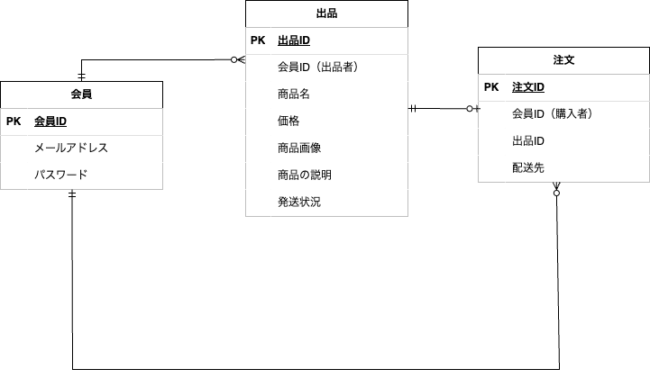

# Practice 練習用フリマサイト(ログイン機能あり)

- 教材で学習した内容のアウトプット学習としてフリマサイトアプリを作成しました。

## 必要要件

- 会員登録・ログイン機能
- 会員登録時、メール認証する
- 商品一覧機能（一覧から商品選択すると、商品の詳細画面へ移動）
- 購入機能（商品の詳細画面から購入する）
- 出品機能
- マイページ（ユーザーの出品、購入、売上情報を表示・出品登録情報の編集機能）
- 出品・購入はログインしたユーザーのみ可能
- 購入された商品には"SOLD"と表示し、再度購入や、出品の取消がされないようにする

## データベース

### 主：users -> 従：products ->従:purchases

|  users   | product | purchases  |
| :------: | :-----: | :--------: |
|    id    |   id    |     id     |
|   name   | user_id |  user_id   |
|  email   |  name   | product_id |
| password |  image  | recipient  |
|          | comment |            |

## ER 図



## 環境構築手順

- コンテナを立ち上げるため、以下を実行

```
docker compose up -d --build
```

- env ファイルの作成をするため、以下を実行

```
cp src/.env.example src/.env
```

- php にコンテナに入るため、以下を実行

```
docker compose exec php bash
```

- composer パッケージをインストールするため、以下を実行

```
composer install
```

- アプリケーションキーを作成するため、以下を実行

```
php artisan key:generate
```

- マイグレーションを実行するため、以下を実行

```
php artisan migrate
```

- 各データのシーディング

```
php artisan make:seeder UserSeeder,
php artisan make:seeder ProductSeeder,
php artisan make:seeder PurchaseSeeder
```

- メール認証機能作成（Mailhog 連携）

```
$ brew install mailhog　（インストール）
$ brew services start mailhog　（MacOS起動時にMailHogが自動的に起動するようにする）
```

- docker-compose.yml に Mailhog サービス を追加し、docker-compose 再起動。

```
$docker-compose down
$docker-compose up -d --build
```

- Laravel のキャッシュクリア

```
php artisan config:clear
php artisan config:cache
```
